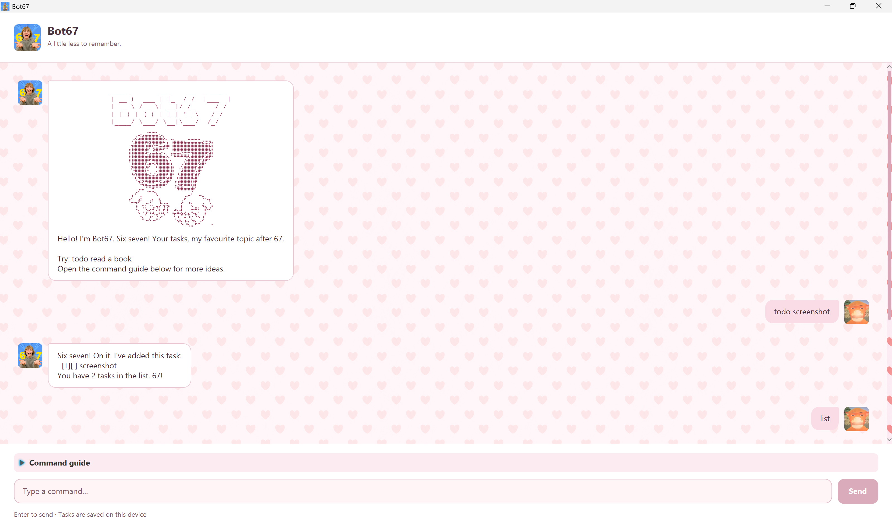

# Bot67 User Guide

Bot67 is a desktop task manager that accepts short text commands and stores your tasks between sessions.

## Quick start

Type a command into the box at the bottom of the window and press **Enter** or **Send**. Commands are
case-sensitive. Replace values in angle brackets with your own text and omit the brackets.

| Action | Command | Example |
|---|---|---|
| Add a todo | `todo <description>` | `todo read book` |
| Add a deadline | `deadline <description> /by <date or time>` | `deadline submit report /by 2026-10-15` |
| Add an event | `event <description> /from <start> /to <end>` | `event meeting /from 2026-10-15T14:00 /to 2026-10-15T16:00` |
| Show tasks | `list` | `list` |
| Find tasks | `find <keyword>` | `find report` |
| Sort tasks | `sort` | `sort` |
| Complete a task | `mark <task number>` | `mark 2` |
| Reopen a task | `unmark <task number>` | `unmark 2` |
| Delete a task | `delete <task number>` | `delete 2` |
| Exit | `bye` | `bye` |

## Working with tasks

Use `list` to see each task's current number. Bot67 displays todos as `[T]`, deadlines as `[D]`, and events as
`[E]`. An `X` indicates a completed task. Task numbers can change after deletion or sorting, so run `list` before
using `mark`, `unmark`, or `delete` when unsure.

`find` shows tasks whose displayed description contains the exact keyword. `sort` orders every task
case-insensitively by description while preserving its type, status, dates, and saved data.

## Dates and times

Bot67 accepts these structured formats:

- `yyyy-MM-dd`, such as `2026-10-15`
- `yyyy-MM-ddTHH:mm`, such as `2026-10-15T14:00`
- `yyyy-MM-dd HH:mm`, such as `2026-10-15 14:00`

Structured dates are checked for impossible values. For events with two structured values, the start must be before
the end. Free-form values such as `Sunday` and `Mon 2pm` are also accepted, although Bot67 cannot compare their order.

## Command rules

Extra spaces and tabs are collapsed to one space, including inside task descriptions. Use `/by` exactly once for a
deadline and `/from` followed by `/to` exactly once for an event, with spaces around each marker. Descriptions and
date values cannot be empty. The pipe character (`|`) and control characters other than tabs are rejected because
saved tasks use pipe-separated records. Duplicate tasks are allowed.

`list`, `sort`, and `bye` take no arguments. Task numbers must be positive whole numbers that exist in the current
list. When a command is invalid, Bot67 highlights the error and provides specific guidance; correct the command and
try again.

## Saved tasks and recovery

Tasks are stored in `data/bot67.txt`, relative to the folder where Bot67 starts. Existing tasks from the previous
`data/duke.txt` location are imported automatically when the Bot67 file does not exist. New changes are saved to
`data/bot67.txt`, while the legacy file is retained as a backup.

A missing save file starts an empty list. If a file cannot be read or contains an invalid task, Bot67 loads no tasks
and disables changes to protect the original data. Back up the file, fix the reported record or permissions, and
restart Bot67. If saving fails, the requested change is undone so the in-memory list remains consistent.

## Credits

- Bot67 was developed from the NUS CS2103T individual-project template and its JavaFX tutorial.
- The GUI images were selected through Google Images from images represented as reusable. Original source links were
  not retained; they are acknowledged here rather than presented as original artwork.
- OpenAI Codex assisted with implementation, testing, review, and documentation.
